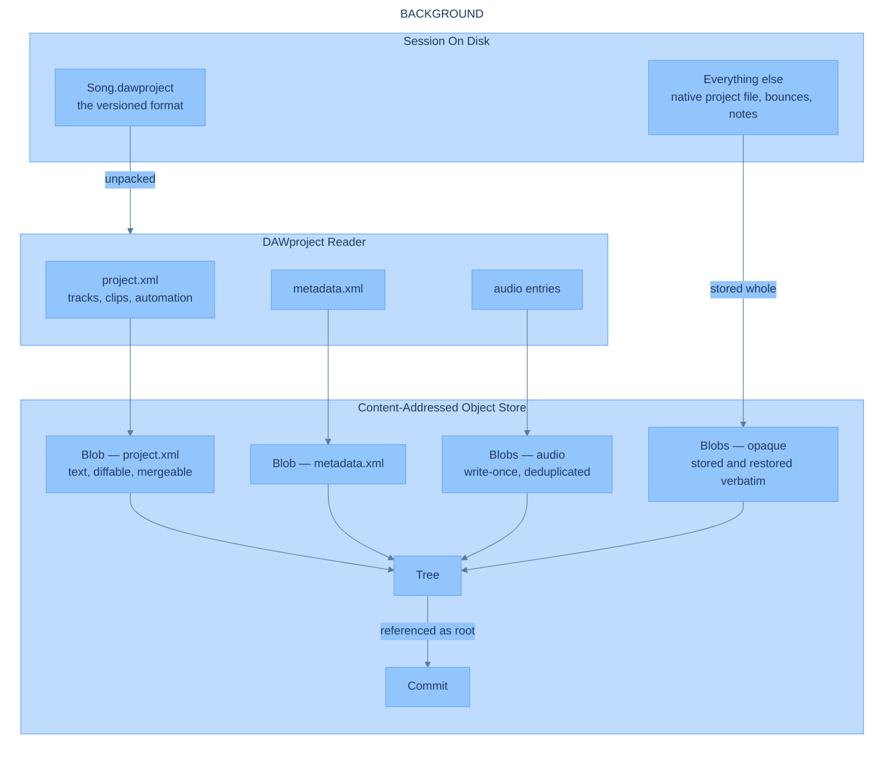
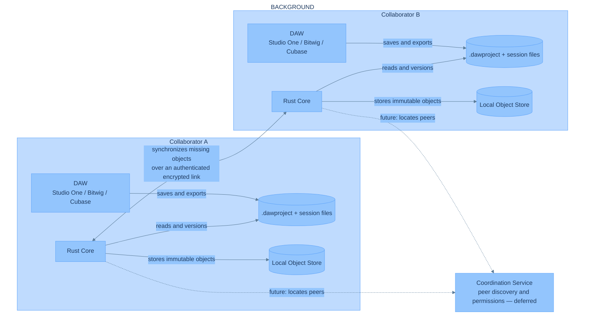
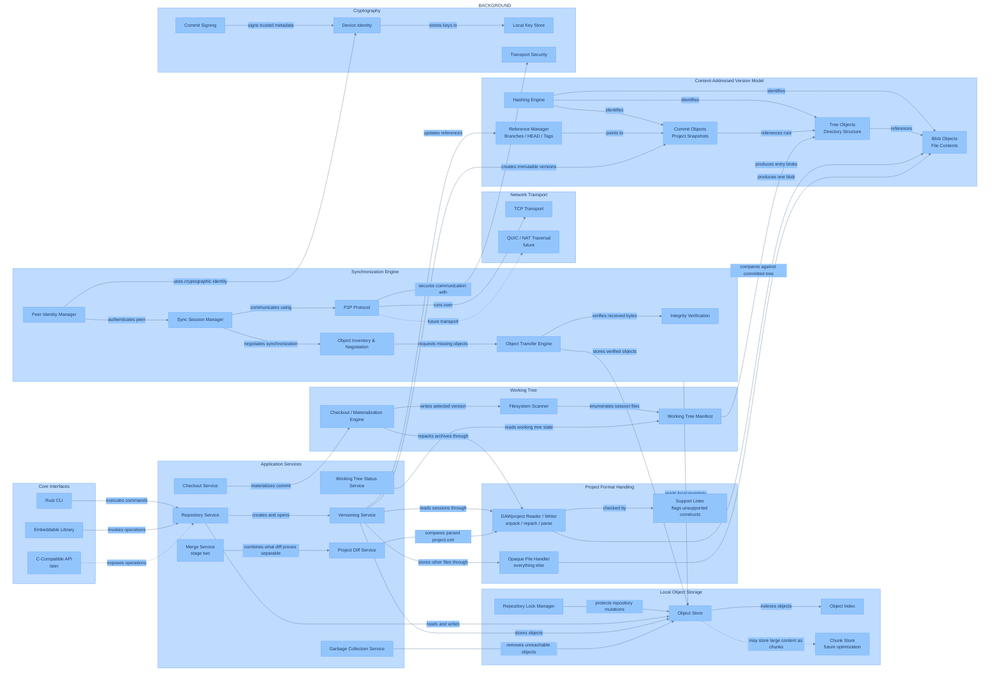
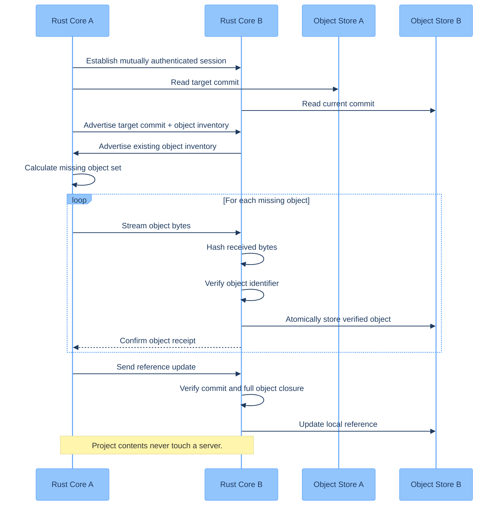
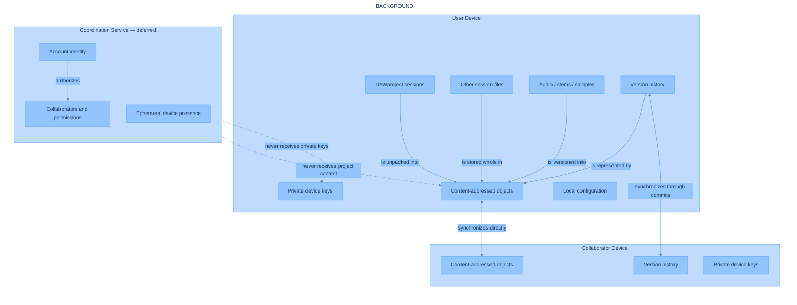

# Git for Music — Architecture Reference

> We host the collaboration. You own the files.

Git for Music is version control for music production projects, built around
**DAWproject** — the open, MIT-licensed project interchange format created by Bitwig
and PreSonus, and supported by Studio One, Bitwig Studio, Cubase, Cubasis, VST Live
and n-Track.

**Status:** this document describes the target architecture. Only the `core/`
directory (the Rust versioning engine) currently exists — see
[`core/MVP.md`](../core/MVP.md) and [`core/Requirements.md`](../core/Requirements.md)
for what is actually being built and why.

## Product framing

Three ideas:

1. **An open project format is what makes real version control possible.** Every
   proprietary DAW format is binary or opaque, and content addressing alone solves
   storage without solving diff or merge. DAWproject is XML plus media in a ZIP
   container — it can genuinely be read, diffed, and eventually merged. The whole
   platform is built on that.
2. **Content lives on the user's device.** Project files, audio, and version history
   are stored locally and synchronized directly between collaborators' devices. No
   service persists project content.
3. **A local versioning engine, written in Rust, is the foundation.** It owns
   content-addressed storage, history, format handling, and peer-to-peer
   synchronization.

This is built for the technology's sake first. Broad DAW adoption of DAWproject is a
bet on the future, not a precondition — the format already works today in the DAWs
listed above, which is enough to build and prove the engine against real sessions.

## DAWproject is the repository format

This is the central design decision, and everything else follows from it.

The core does not "support" DAWproject alongside other formats. DAWproject **is** the
representation a repository is built out of. A session's `.dawproject` is the source
of truth for its history, its diffs, and its merges.

Every other file in the project directory — including the DAW's own native project
file, bounces, notes, artwork — is tracked as an opaque blob. Those files are stored,
versioned, and restored byte-for-byte, but they carry no special semantics. The core
has exactly one source of truth, not two competing ones.

This is a deliberate bet rather than a hedge. Being aligned with the format's own
direction means capability arrives without this project building it: as DAWproject
grows, what can be versioned, diffed, and merged grows with it. The cost is accepting
the format's ceiling as this project's ceiling.

### Why the archive is unpacked rather than stored whole

A `.dawproject` is a ZIP containing `project.xml`, `metadata.xml`, and the session's
audio. The core unpacks it on ingest and stores each entry as its own blob in a tree,
rather than storing the archive as a single blob. This has three consequences:

- **Audio deduplicates for free.** Recorded audio is write-once; the same take keeps
  the same content hash and is stored once no matter how many commits reference it.
- **Per-commit growth is the size of the changed XML**, not the size of the session.
  A gigabyte project costs a gigabyte once, then kilobytes per commit.
- **The timeline diffs as text**, because `project.xml` is text and the core stores it
  decompressed.

Checkout repacks the archive canonically. Every entry's content is byte-identical to
what was committed; the ZIP container itself is regenerated rather than preserved
byte-for-byte.

### Being explicit about what is supported

DAWproject is a young format and its implementations are uneven. Not everything a DAW
can express survives an export, and what survives differs between DAWs — Studio One
does not read Bitwig clip launcher data, Bitwig does not read Studio One AU plugin
state, video tracks do not cross. These are gaps between products, not limits of the
format, and they will close over time.

A project therefore declares a **mode**: *cross-DAW*, restricting itself to
constructs that travel between DAWs, or *single-DAW*, pinned to one DAW and free to
use anything it emits. The mode is advisory — the core cannot stop a DAW writing what
it likes — but it determines what the core promises, what it warns about, and what
diff and merge are willing to rely on. See
[Requirements.md](../core/Requirements.md#project-mode-cross-daw-or-single-daw).

The project's response is to be explicit rather than to work around it:

- The core documents exactly which DAWproject constructs it understands, and says so
  plainly. Anything it does not understand is preserved verbatim on round trip but
  excluded from diff and merge.
- The core can **lint a session** and report which of its features are unlikely to
  survive a round trip, so a user finds out before committing rather than after
  restoring. This is only possible because the format is open, and it is one of the
  clearest examples of the engine being worth more than the format alone.
- Support grows as the format and its implementations grow. Nothing here is designed
  around today's gaps.

### The measurement this design depends on

One question sits underneath everything above and has not been answered by anyone,
because nobody currently uses the format this way: **is a same-DAW round trip
faithful?** Studio One → `.dawproject` → Studio One, out and back.

Every documented fidelity gap is a gap between two *different* DAWs, so none of them
necessarily applies. If the round trip is faithful, the native project file is
unnecessary and can stop being tracked at all. If it is not, the native file stays as
a safety net while the gaps close upstream. Either way it is an afternoon's
experiment, and [MVP.md](../core/MVP.md) runs it first.

## Components

| Component | Responsibility | Status |
| --- | --- | --- |
| `core` (Rust) | Local storage, content-addressed versioning, DAWproject format handling, and P2P synchronization | **In this repository.** See [`core/MVP.md`](../core/MVP.md). |
| `protocol` | Formally versioned wire protocol for sync sessions and object transfer | Not here yet. Extracted once the core's in-process sync protocol is stable enough to need a versioned contract. |
| Coordination service | Peer discovery and permissions for collaborators who are not on the same network | Deferred and deliberately unspecified. Not required for the first networked milestone, which addresses peers directly. |

There is no UI component in this design. The core is a library plus a CLI; a
C-compatible API is a later addition, added when something concrete needs to embed
the engine rather than in anticipation of it.

## Diagrams

All diagrams share one Mermaid theme (defined by the `%%{init: ...}%%` directive
embedded in each block) so any new diagram should reuse the same directive.

### Project ingestion

How a session on disk becomes objects in the store. This is the model described
above, and the diagram to read first.

### System overview

Two collaborators, their local stores, and the direct link between them. Project
content is never persisted by any service.

### Rust core

The internal design of the engine — interfaces, format handling, versioning,
storage, working tree, synchronization, and cryptography.

### P2P synchronization

Missing-object transfer between two cores. Because the export is unpacked, the
objects negotiated here are individual audio entries and XML files — so a peer that
already has the audio transfers only the changed timeline.

### Data ownership

What lives on the device and what never leaves it.

## Prior art worth tracking

- [DAWproject specification](https://github.com/bitwig/dawproject) — MIT, the format
  this platform is built on.
- [ProjectConverter](https://github.com/git-moss/ProjectConverter) — converts several
  native DAW formats to DAWproject without the DAW, a possible path to supporting
  producers whose DAW has no native export.
