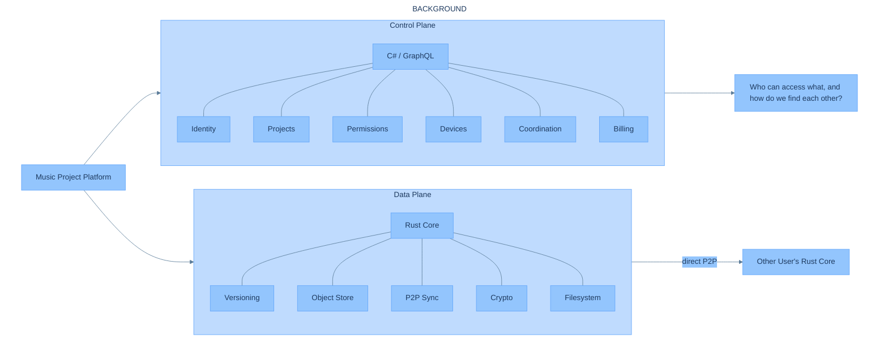
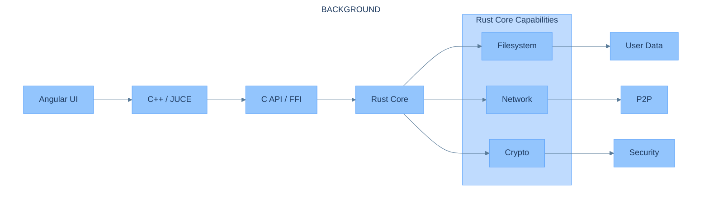
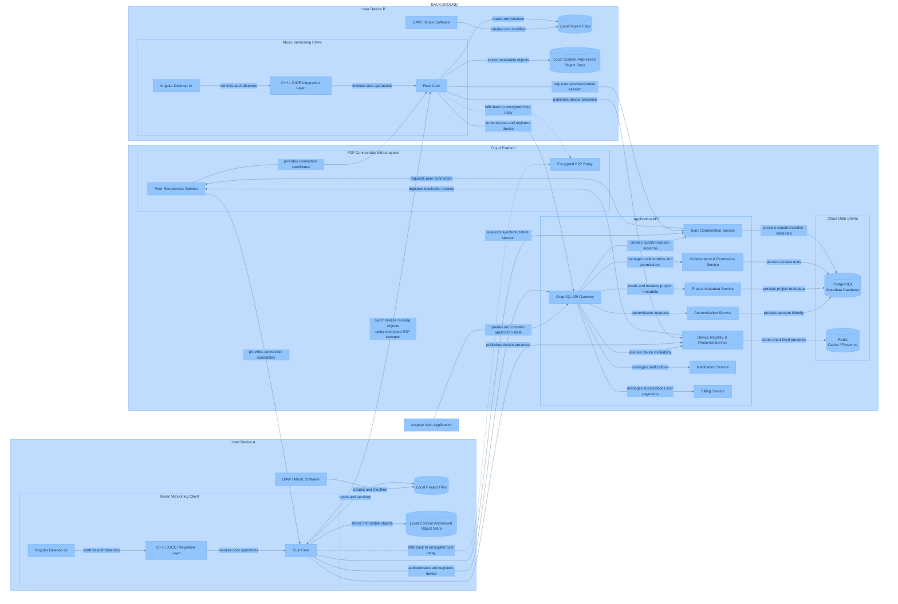
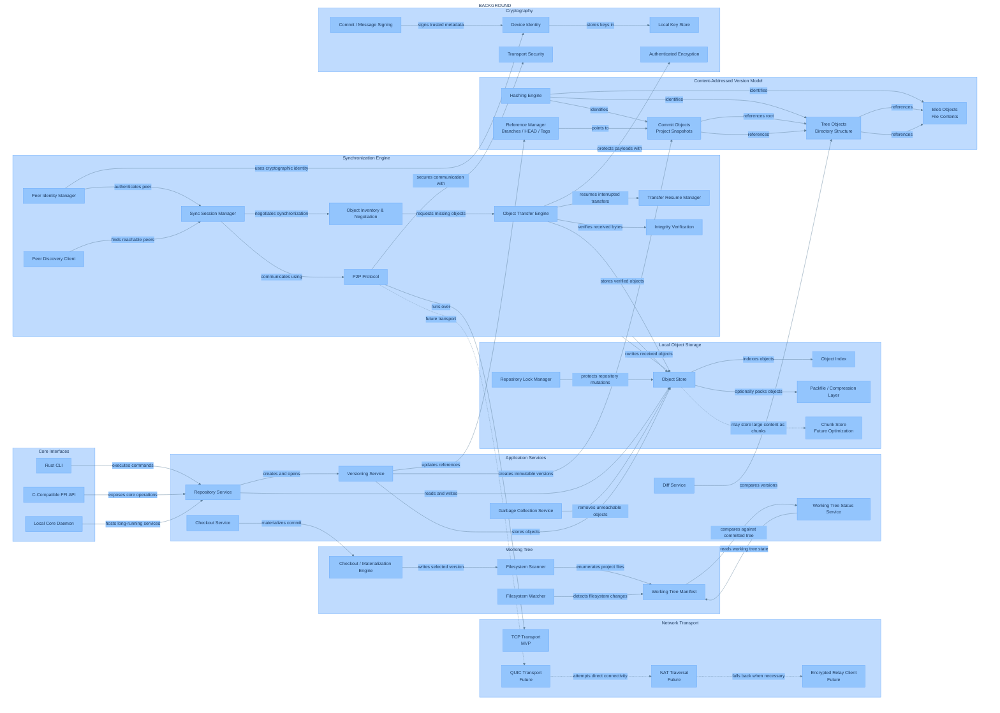
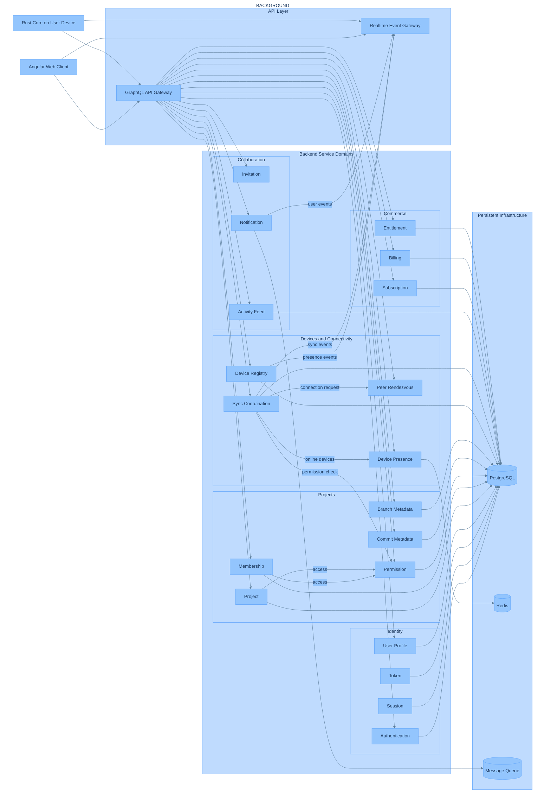
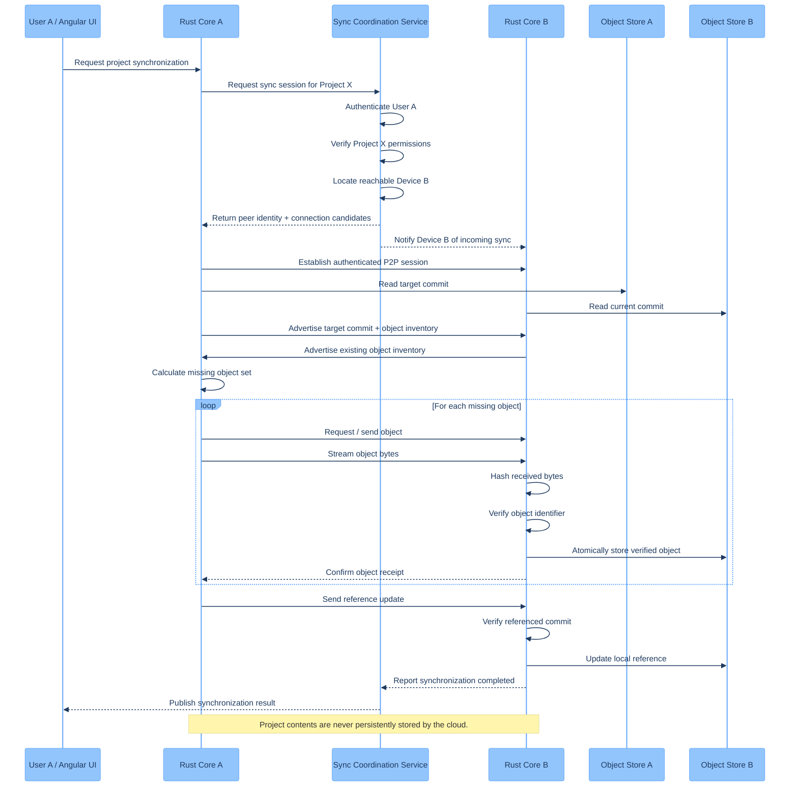
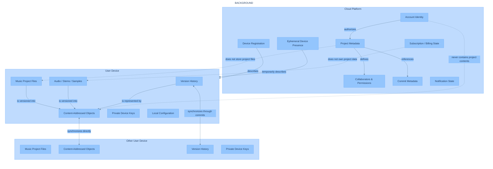
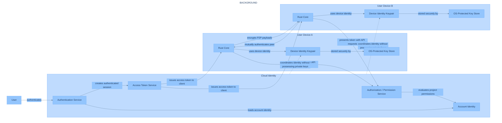
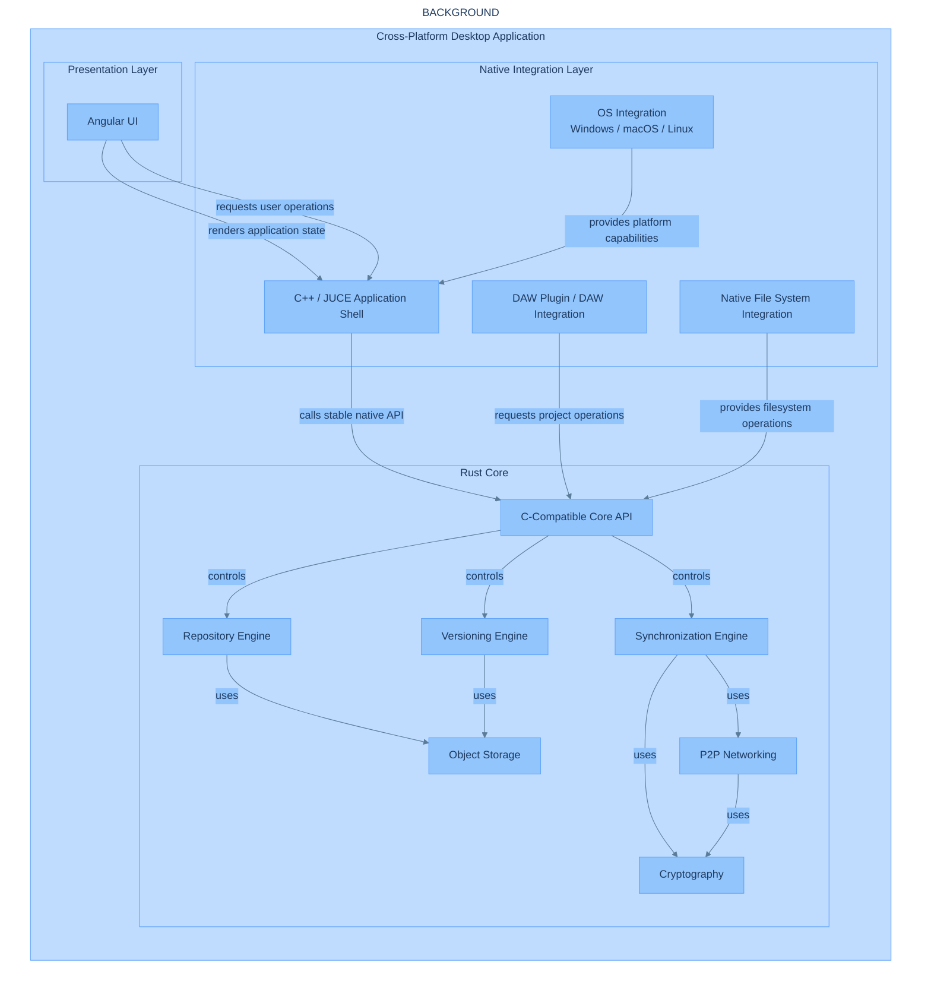

# Git for Music — Architecture Reference

> We host the collaboration. You own the files.

This is the single consolidated reference for the Git for Music platform: the product
framing, the intended repository structure, the component responsibilities, and the
full set of architecture diagrams. 

**Status:** this document describes the target platform architecture. Only the
`core/` directory (the Rust versioning engine) currently exists in this repository —
see [`core/MVP.md`](../core/MVP.md) and [`core/Requirements.md`](../core/Requirements.md)
for what is actually being built right now and why the rest is deliberately not yet
scaffolded.

## Product framing

Git for Music is a cross-platform system for versioning and sharing music production
projects (DAW projects, stems, samples). It is built around three ideas:

1. **Content lives on the user's device, not in the cloud.** Project files, audio,
   and version history are stored locally and synchronized directly between
   collaborators' devices (peer-to-peer). The cloud never persists project content.
2. **The cloud is a coordination layer only.** A proprietary C# backend handles
   identity, project/collaborator metadata, permissions, device presence, and P2P
   rendezvous — but not file content. It lives in a separate, private repository and
   is not implemented here.
3. **A local versioning engine, written in Rust, is the foundation.** It owns
   content-addressed storage, history, and P2P synchronization, and exposes a stable
   C-compatible API so it can be embedded in different shells (CLI, desktop app,
   future DAW plugin).

## Repository components

The platform is designed around five logical components. Today, only the first is
present in this repository; the rest describe where the project is headed.

| Component | Responsibility | Status |
| --- | --- | --- |
| `core` (Rust) | Local storage, content-addressed versioning, and P2P synchronization engine | **In this repository.** See [`core/MVP.md`](../core/MVP.md) and [`core/Requirements.md`](../core/Requirements.md). |
| `frontend` (Angular) | Presentation layer for the desktop/web client | Not in this repository yet. Deferred until the core versioning engine is proven standalone. |
| `protocol` | Shared wire protocol for peer identity, sync sessions, object negotiation/transfer, integrity verification, and reference updates | Not in this repository yet. Will be extracted once the core's in-process sync protocol is stable enough to need a formal, versioned contract. |
| `infra` | Repository-local infrastructure for the open-source client (packaging, CI, etc.) | Not in this repository yet. |
| Cloud backend (C#) | Identity, project/permission metadata, device presence, sync coordination, billing | Proprietary, maintained in a separate repository. Represented here only as an architecture boundary — see the diagrams below. |

The C++/JUCE native integration layer (the desktop shell that hosts the Angular UI
and calls into the Rust core) is also represented in the diagrams but is not
implemented in this repository.

### Why the repository is scoped to `core/` right now

The project was documentation-heavy relative to what had been built: nine diagrams
and five component READMEs existed before any code did. The repository has been
deliberately narrowed to just the Rust core so that the hardest and most
foundational open question — whether content-addressed versioning and diff/merge
are viable for real, mostly-binary DAW project files — gets answered before
networking, cloud, and UI work begins. See [`core/MVP.md`](../core/MVP.md).

### Longer-term repository evolution

Once the core is proven, the project is expected to grow through repository-structure
stages, splitting only when ownership, access control, release cadence, or API
stability actually require it — not by programming language alone:

1. **Monorepo:** build initial vertical slices for Rust, C#, Angular, protocol
   contracts, and local infrastructure together while boundaries are still changing.
2. **Three repositories:** separate `gitformusic-core` (Rust), `gitformusic-backend`
   (C#), and `gitformusic-desktop` (Angular + desktop integration) once their release
   cadences diverge.
3. **Five repositories:** split out `gitformusic-protocol` and
   `gitformusic-infrastructure` once their ownership and compatibility policies are
   stable enough to version independently.

The repository should stay in the simplest stage that supports current development —
right now, that stage is "core only," a step even before stage 1.

## Diagrams

All diagrams share one Mermaid theme (light blue, defined by the `%%{init: ...}%%`
directive embedded at the top of each block below) so any new diagram added to this
document should reuse the same directive for visual consistency.

### Architecture overview

Control plane (C#/GraphQL) vs. data plane (Rust core), and the direct P2P link
between peers' data planes.

### Dependency direction

Angular, JUCE, FFI, and Rust dependency flow, and what the Rust core's own
capabilities (filesystem, network, crypto) are ultimately in service of.

### System overview

Two client devices, cloud coordination, local stores, and the P2P transfer path
between them.

### Rust core

Core interfaces, versioning, storage, synchronization, networking, and cryptography
— the full internal design of the component that is now the sole focus of this
repository. See [`core/Requirements.md`](../core/Requirements.md) for how this maps
to concrete requirements, and [`core/MVP.md`](../core/MVP.md) for what subset is
being built first.

### Cloud backend (reference only)

Proprietary C# service domains and persistent infrastructure. This is reference
architecture only — it documents the boundary the Rust core talks to; it is not
implemented in this repository and is maintained privately.

### P2P synchronization

Missing-object transfer sequence between two Rust cores, coordinated (but not
witnessed in content) by the cloud.

### Data ownership and storage

What lives on the user's device, what lives in the cloud, and what never crosses
that boundary.

### Identity and security

Account identity, device keys, authorization, and encrypted peer traffic.

### Desktop application boundaries

Angular, JUCE, the C-compatible API, and Rust boundaries inside the desktop client.

